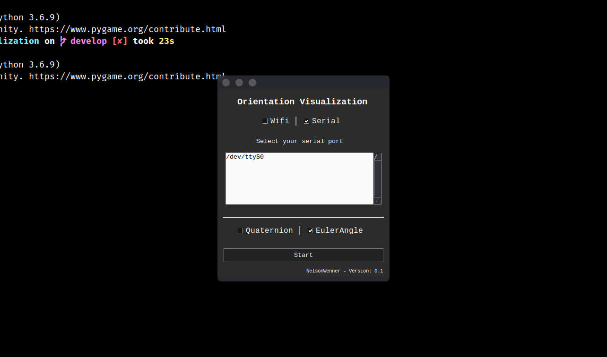

<h2 align="center">
  ORIENTATION VISUALIZATION
</h2>

## :bulb: About
The module that allows observing orientations through a 3D object from Euler angles or quaternion transmitted with WebSocket via wi-fi or serial port.

## :movie_camera: Preview

<div align="center">
  
</div>

## :rocket: Technologies

* [Python3](https://www.python.org/)
* [OpenGL](https://pypi.org/project/PyOpenGL/)
* [Pysimplegui](https://pysimplegui.readthedocs.io/en/latest/)

## :raised_hand: Warning
To use this module, remember that data must be transmitted via serial port or WIFI in string where each data has to be separated by a comma.
* Quaternion
  ```json
  "w,x,y,z"
  ``` 
  * Data example
    ```json
    "00.0000000,00.0000000,00.0000000,00.0000000"
    ``` 

* Euler angles
  ```json
  "pitch,roll,yaw"
  ``` 
  * Data example
    ```json
    "00.0000000,00.0000000,00.0000000"
    ``` 

## :information_source: Getting Started

1. Fork this repository and clone it on your machine.
2. Change the directory to `python-orientation visualization-app` where you cloned it.

## :zap: Module Getting Started

1. Install requirements.
```shell
$ pi3 install -r requirements.txt
```
2. Startup
```shell
$ python3 App.py
```
* If you are going to use data transmission via Wifi, when connecting, keep in mind that the WebSocket server `IP` will be your machine's `IP` and port `8080`.
---
Made with :hearts: by Nelson Wenner :wave: [Get in touch!](https://www.linkedin.com/in/nelsonwenner/)